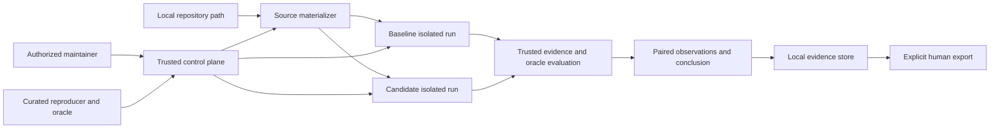

# Abaris Threat Model

## Status and scope

This is a design-stage threat model for the planned v0 paired experiment. No
runtime exists, so every control is a requirement rather than an implemented
guarantee.

In scope:

- local repository path and Git revision handling;
- curated public reproducer and oracle inputs;
- setup and reproduction execution;
- isolation and resource enforcement;
- evidence collection and observation assignment;
- conclusion derivation;
- local evidence storage and explicit export.

Out of scope:

- private vulnerability reports;
- community reproducer intake;
- discovery, exploitation, root-cause, variant, or affected-range analysis;
- hosted or multi-tenant execution;
- automatic patching or disclosure; and
- broad regression validation.

## Security assumptions

- The operator is authorized to test the local repository and revisions.
- The repository, revisions, build behavior, dependencies, reproducer, oracle
  inputs, and workload outputs may be malicious.
- Curated public status does not imply executable trust.
- The trusted control plane and selected isolation backend are not already
  compromised.
- A supported run is refused when mandatory controls cannot be verified.
- The oracle observation is assigned by trusted deterministic evaluation, not
  accepted directly from workload output.

## System model

## Trust boundaries

| Boundary | Untrusted or sensitive data | Required controls |
| --- | --- | --- |
| Operator to control plane | Paths, revisions, policy, export intent | Strict validation, explicit authorization acknowledgement, safe path handling |
| Local repository to materializer | Git objects, files, submodules, metadata | No repository code execution, immutable resolution, bounded parsing, no working-tree mutation |
| Control plane to isolated runs | Source snapshots, setup, reproducer, limits, policy | No host secrets, home mounts, Docker socket, undeclared devices, privileges, or writable host paths |
| Setup run to network | Dependency and setup traffic | Explicit policy, recorded destinations and outcomes where supported, no implicit access |
| Reproduction participants to network | Local service traffic, potential probes, or exfiltration | No network for non-network cases; closed declared reproducer-target network for service cases; no external egress or host access |
| Workload to trusted evaluator | Logs, files, status, signals, artifacts | Treat as untrusted, bound sizes, record provenance, evaluate oracle outside workload authority |
| Evidence store to export | Potentially sensitive evidence | Local by default, explicit human action, destination and content review |

## Assets

| Asset | Security objective |
| --- | --- |
| Host secrets, home directory, sockets, and devices | Confidentiality and integrity |
| Local repository and working tree | Confidentiality and integrity |
| Isolation boundary and host availability | Confidentiality, integrity, and availability |
| Immutable input identities | Integrity |
| Oracle semantics and evaluation | Integrity |
| Evidence bundle and observation record | Integrity and availability |
| Vulnerability details and artifacts | Confidentiality and integrity |
| Publication decision | Integrity and confidentiality |

## Attacker capabilities

- Supply malicious content through a repository revision, dependency, setup
  behavior, reproducer, fixture, oracle input, or workload output.
- Attempt sandbox escape, host access, persistence, or resource exhaustion.
- Use setup network access for exfiltration, mutable dependency substitution, or
  attacks against other systems.
- Abuse a reproduction runtime's internal gateway or host reachability despite
  apparent external isolation.
- Trigger Git hooks, filters, credential helpers, LFS downloads, submodule
  acquisition, remote helpers, or unsafe symlinks during materialization.
- Forge or suppress evidence to obtain `PRESENT`, `ABSENT`, or a preferred
  conclusion.
- Exploit ambiguity between `ABSENT` and `INDETERMINATE`.
- Manipulate source identity or comparison conditions between revisions.
- Place secrets or sensitive content in evidence to induce disclosure.

## Attack tree: corrupt or weaponize the paired experiment

Root goal: harm the operator or cause a misleading Abaris result.

1. Compromise the host.
   - Escape isolation.
   - Access a home-directory mount or host secret.
   - Control the host through a Docker or equivalent socket.
   - Exhaust host resources.
2. Abuse network access.
   - Exfiltrate data during setup.
   - Resolve mutable or malicious dependencies.
   - Probe third-party or production systems.
3. Corrupt the observation.
   - Forge oracle output.
   - Convert a timeout or missing artifact into `ABSENT`.
   - Manipulate logs or truncate decisive evidence.
   - Exploit a parser or oracle evaluator.
4. Corrupt the comparison.
   - Apply different reproducers, oracles, policies, or undeclared conditions.
   - Resolve mutable source or environment identities.
   - Hide a candidate-only `PRESENT` result behind a coarse conclusion.
5. Cause unauthorized publication.
   - Insert sensitive content into evidence.
   - Trigger an implicit export.
   - Misrepresent public-corpus status.

## Threat model

| ID | Threat | Likelihood | Impact | Priority | Required mitigation |
| --- | --- | --- | --- | --- | --- |
| TM-001 | Untrusted execution escapes isolation or accesses host-controlled resources | Medium | High | Critical | Disposable isolation; no host secrets, home mounts, Docker socket, undeclared devices, privileges, or writable host paths; capability verification; fail closed |
| TM-002 | Setup network access enables exfiltration, mutable inputs, or third-party attacks | Medium | High | High | Explicit setup-network policy; default deny recommendation; record policy and network-relevant evidence; refuse unsupported modes |
| TM-003 | Reproduction networking reaches external systems, host services, metadata, or undeclared peers | Medium | High | High | No network for non-network cases; closed per-run declared reproducer-target network for service cases; deny external egress, host gateway, metadata, external DNS, published ports, and undeclared peers; fail closed |
| TM-004 | Workload output directly or indirectly forges the oracle observation | High | High | Critical | Trusted deterministic oracle evaluation outside workload authority; schema validation; bounded evidence; preserve evaluator inputs and result |
| TM-005 | Execution failure, timeout, truncation, or missing evidence is mislabeled `ABSENT` | High | High | Critical | Explicit three-state semantics; mandatory `INDETERMINATE` with bounded failure reason on unreliable evaluation; table-driven state tests |
| TM-006 | Baseline and candidate experiments differ beyond the source revision | Medium | High | High | Comparison-equivalence contract; digest reproducer, oracle, policy, environment, and permitted differences; refuse undeclared divergence |
| TM-007 | Mutable or ambiguous source, dependency, or environment identity invalidates evidence | High | High | High | Resolve immutable identities; content-address evidence; record setup-network effects and unresolved inputs; fail closed |
| TM-008 | Malicious input exhausts CPU, memory, processes, disk, output, or time | High | Medium | High | Externally enforced limits and guaranteed teardown; preserve limit events |
| TM-009 | A coarse conclusion hides important paired observations or implies universal remediation | Medium | High | High | Observations are mandatory primary output; complete conclusion matrix; constrained wording; no unsupported security claims |
| TM-010 | Evidence or export leaks sensitive content or publishes without approval | Medium | High | High | Local storage by default; explicit human export; content review; restrictive permissions; no automatic disclosure |
| TM-011 | Trusted parser or oracle evaluator is exploited by malformed input or evidence | Medium | High | High | Strict bounded schemas, safe path handling, no implicit shell, evaluator minimization, negative security tests |
| TM-012 | AI-generated output influences deterministic observations or conclusions | Low in v0 | High | Medium | No AI dependency or authority in the deterministic core; preserve deterministic decision path |
| TM-013 | Git materialization executes implicit behavior or resolves undeclared external objects | High without hardening | High | Critical | Abaris-controlled non-interactive Git environment; ignore inherited config; disable hooks, filters, credentials, LFS, submodules, external protocols, alternates, promisor acquisition, and replace refs; validate symlinks; prefer tree-object extraction |
| TM-014 | A stable schema is published before real cases expose missing or unsafe semantics | Medium | Medium | Medium | Private disposable drafts only; require 3–5 representative reviewed cases before public stability |

## Security requirements

| Requirement | Priority | Threats | Acceptance criteria |
| --- | --- | --- | --- |
| SR-001: Verify mandatory isolation before execution | Critical | TM-001 | A run is refused if isolation, mount, secret, socket, privilege, or resource controls cannot be verified |
| SR-002: Expose no host secrets, home mounts, or Docker socket | Critical | TM-001 | Conformance tests from inside the workload cannot access these resources |
| SR-003: Apply explicit setup and closed reproduction network policies | Critical | TM-002, TM-003 | Both policies are recorded; non-network cases have no network; service cases allow only declared reproducer-target traffic; unenforceable policy refuses execution and violations cannot yield a definitive observation |
| SR-004: Assign observations through trusted three-state oracle evaluation | Critical | TM-004, TM-005, TM-011 | Workload output cannot directly set an observation; unreliable evaluation yields `INDETERMINATE` with a bounded failure reason |
| SR-005: Preserve comparison equivalence | Critical | TM-006 | Reproducer, oracle, policy, environment contract, and permitted differences are content-identified and checked for both runs |
| SR-006: Resolve immutable input identities | High | TM-007 | Every accepted run records exact source, reproducer, oracle, environment, policy, and declared setup-input identities |
| SR-007: Preserve content-addressed evidence | High | TM-004, TM-005, TM-007 | Every retained evidence object has provenance, digest, and explicit omission or truncation status |
| SR-008: Enforce resource limits outside the workload | High | TM-008 | CPU, memory, processes, disk, output, and wall-clock limits are enforced and limit events preserved |
| SR-009: Keep observations primary and conclusions conservative | Critical | TM-009 | Every result displays both observations; all nine pairs follow the documented matrix; output contains claim limitations |
| SR-010: Require human-controlled publication | Critical | TM-010 | No evidence or conclusion leaves local storage without explicit human export |
| SR-011: Keep AI outside the deterministic core | High | TM-012 | Observation and conclusion provenance contains no AI-dependent decision step |
| SR-012: Materialize Git source without implicit execution | Critical | TM-007, TM-013 | Conformance tests show hooks, filters, credentials, LFS, submodules, protocols, and unsafe symlinks cannot execute or escape policy; every attempt records controls, violations, and outcome |
| SR-013: Gate public schema stability on representative cases | High | TM-014 | Every draft self-identifies as `private-draft` with no compatibility guarantee; no stable schema is published before 3–5 reviewed cases meet documented diversity criteria |

## Residual risks

- No isolation backend can eliminate all escape risk.
- Setup network access, when enabled, weakens reproducibility and expands the
  attack surface.
- A curated reproducer can be incomplete, misleading, or malicious.
- `ABSENT` only means the defined oracle did not demonstrate presence under the
  recorded conditions.
- `REPRODUCER_BLOCKED` can be misread as a fix claim despite constrained
  documentation.
- Content addressing demonstrates integrity and identity, not correctness,
  completeness, confidentiality, or safety.

## Required review triggers

Update this threat model before:

- selecting an execution backend;
- supporting any setup-network access mode;
- changing the closed reproduction-network policy;
- enabling LFS, submodules, remote Git source, or checkout-based materialization;
- selecting the first target ecosystem;
- changing oracle semantics or conclusion mapping;
- accepting community or private inputs;
- adding hosted execution, AI influence, or automatic export; or
- expanding any v0 exclusion.
