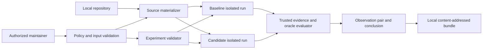

# Abaris Architecture

## Status

This document defines the planned v0 architecture. No components exist yet.
Requirements described here are not implemented guarantees.

## Architectural objective

Abaris performs one controlled paired experiment:

```text
local repository
+ immutable baseline revision
+ immutable candidate revision
+ one supplied reproducer
+ one vulnerability-presence oracle
+ one comparison policy
-> two isolated runs
-> two primary observations
-> one conservative derived conclusion
-> one content-addressed evidence bundle
```

The architecture must make it difficult to accidentally claim more than the
experiment demonstrates.

## v0 boundaries

v0 accepts only local repository paths and curated, already-public historical
vulnerability cases.

v0 does not perform discovery, exploit generation, root-cause verification,
variant analysis, affected-version inference, duplicate detection, automatic
patch generation, automatic disclosure, hosted execution, or broad regression
analysis.

The first target ecosystem remains an open decision.

## System model



## Planned components

### Trusted control plane

The control plane validates the experiment, checks policy, coordinates both
runs, collects evidence, assigns observations, and derives the conclusion.

It must not:

- execute repository-provided behavior directly on the host;
- accept workload text as an authoritative observation;
- expose host secrets, home-directory mounts, or a Docker socket;
- silently change policy between runs; or
- use AI to assign observations or conclusions.

### Source materializer

The materializer accepts a local repository path and resolves baseline and
candidate Git references to immutable commit identities.

It must:

- operate in an Abaris-controlled, non-interactive Git environment;
- ignore inherited system, global, user, and untrusted repository-local
  configuration where possible;
- disable hooks, clean/smudge/process filters, credential helpers, automatic
  LFS downloads, submodule initialization, and external protocols;
- avoid Git hooks and all repository code execution;
- avoid modifying the operator's working tree;
- reject submodules and external content by default;
- reject object alternates, promisor or partial-clone acquisition, replace
  refs, and other object-resolution behavior that can read undeclared external
  content;
- reject unsafe symlinks before execution;
- create isolated source snapshots;
- preserve exact commit, tree, snapshot, Git-version, and materialization-policy
  identities;
- emit a trusted materialization record containing requested controls, enforced
  controls, rejected features, violations, and final outcome; and
- reject unsafe paths and unresolved required identities.

A local path is an input-location restriction, not a trust guarantee.

The preferred strategy is direct extraction from Git tree objects into an
Abaris-owned directory, with explicit file-type and symlink validation. A
sanitized checkout may be evaluated only as a bounded fallback. Normal
`git clone && git checkout`, inherited Git configuration, LFS smudge, and
automatic submodule initialization are not acceptable v0 materialization.

### Experiment validator

The validator checks one reproducer, one oracle, and one comparison policy.
Inputs must be versioned, bounded, explicit, and content-identified.

It must reject:

- unknown or unsupported behavior;
- implicit shell execution;
- undeclared mounts, secrets, sockets, devices, or privileges;
- missing resource limits;
- missing setup-network or reproduction-network policy;
- mutable required input identity; and
- any comparison that cannot satisfy the equivalence contract.

### Execution backend

Each revision runs in a separate disposable isolated environment. A qualifying
backend must provide:

- no host secrets;
- no home-directory mount;
- no Docker or equivalent host-control socket;
- no undeclared writable host path;
- no unnecessary device, privilege, or capability;
- explicit setup-network enforcement;
- no reproduction network for non-network cases;
- a closed per-run network for declared service-target cases;
- external reproduction egress denied;
- externally enforced CPU, memory, process, disk, output, and wall-clock
  limits; and
- guaranteed teardown.

Containers may be used inside a supported design, but containers alone are not
a sufficient hostile-code boundary.

### Closed reproduction network

For a service-target case, the backend creates one new per-run network
containing only:

- one reproducer participant; and
- one declared target participant.

The policy permits reproducer-initiated connections only to declared target
aliases and ports, plus response traffic for those connections. It denies:

- external egress;
- host and gateway access;
- cloud metadata and link-local metadata ranges;
- at minimum `169.254.0.0/16`, `169.254.169.254/32`,
  `fd00:ec2::254/128`, and `fd20:ce::254/128`;
- runtime-provided host aliases such as `host.docker.internal` and
  `gateway.docker.internal`;
- external DNS;
- target-initiated connections to the reproducer unless a future case
  explicitly requires and models them;
- undeclared peers and ingress;
- published host ports; and
- IPv6 unless explicitly modeled and equivalently restricted.

The backend must detect or record policy violations and fail closed if it cannot
apply the policy. Docker or another runtime may help implement this design, but
an internal runtime network alone is insufficient because host or gateway
communication may remain possible.

If mandatory network controls cannot be applied or verified before execution,
the run is refused. A control failure or violation discovered after execution
begins makes the affected observation `INDETERMINATE` with a bounded
`failure_reason`; it cannot yield `PRESENT` or `ABSENT`.

### Trusted evidence collector and oracle evaluator

The evaluator consumes collected evidence and assigns exactly one observation
per revision:

- `PRESENT`
- `ABSENT`
- `INDETERMINATE`

The workload cannot set this state directly. If the oracle is represented by
executable or workload-produced behavior, its outputs remain untrusted inputs
to trusted evaluation.

Each run result keeps three concepts separate:

- `observation`: exactly one of `PRESENT`, `ABSENT`, or `INDETERMINATE`;
- `failure_reason`: a bounded technical reason required only when the
  observation is `INDETERMINATE`; and
- `evidence`: the attributable inputs used by trusted evaluation.

`failure_reason` is reserved for `INDETERMINATE`. Determinate runs may record
warnings or non-decisive events separately, but those records cannot be
represented as the reason for an indeterminate observation.

The derived conclusion remains a separate paired-run result.

The exact permitted oracle language remains unresolved. A small declarative
oracle is the strongest default because it minimizes the trusted computing
base, but it may not express every useful historical case.

### Conclusion derivation

The conclusion derivation is a deterministic pure mapping from the two
observations. It must not inspect narrative metadata or use AI.

### Local evidence store

The evidence store preserves a self-describing content-addressed bundle.
Publication and export require explicit human action.

Content addressing proves object identity and detects modification. It does not
prove that evidence is complete, correct, confidential, or safe to publish.

## Paired-experiment equivalence contract

The comparison is valid only if both runs use the same:

- reproducer identity;
- oracle identity and semantics;
- declared fixtures and inputs;
- control-plane version and observation rules;
- comparison policy;
- setup-network and reproduction-network policy;
- resource-limit policy;
- base environment contract; and
- permitted difference rules.

The source revision is intentionally different. Revision-owned dependency
manifests and setup outcomes may therefore differ, but those differences must
be recorded as evidence and may cause `INDETERMINATE` when they prevent a
meaningful comparison.

No difference may be silently normalized away.

## Execution phases

### 1. Validate

Validate authorization acknowledgement, local path, experiment schema, oracle,
limits, policy, and supported capabilities.

### 2. Materialize

Resolve immutable source identities and create separate snapshots without
executing repository code.

### 3. Setup

Prepare each isolated environment. Setup may execute untrusted project or
dependency behavior.

Setup network requires an explicit policy. Enabling it weakens reproducibility
and expands the attack surface; all relevant policy and outcomes must be
recorded. The exact supported policy modes remain unresolved.

### 4. Reproduce

Apply the same reproducer to each prepared revision. Non-network cases receive
no reproduction network. Service-target cases receive only the closed per-run
network defined above.

### 5. Collect

Collect bounded trusted observations and declared artifacts outside workload
authority. Record omissions, truncation, timeouts, violations, and failures.

### 6. Evaluate

Apply the same oracle semantics to each run and assign one three-state
observation.

### 7. Derive

Map the paired observations to one conclusion.

### 8. Preserve and teardown

Finalize the content-addressed bundle and destroy both isolated environments.

## Observation semantics

### `PRESENT`

Assign only when:

- the run and required controls completed in a supported state;
- required evidence is complete and valid; and
- trusted oracle evaluation demonstrates the defined presence condition.

### `ABSENT`

Assign only when:

- the run and required controls completed in a supported state;
- required evidence is complete and valid; and
- trusted oracle evaluation did not demonstrate the defined presence
  condition.

`ABSENT` is not proof that a vulnerability is fixed or absent generally.

### `INDETERMINATE`

Assign when reliable `PRESENT` or `ABSENT` evaluation is impossible, including:

- setup or reproduction failure that invalidates the oracle;
- timeout or resource-limit event that prevents reliable evaluation;
- missing, contradictory, invalid, or truncated required evidence;
- unsupported behavior or environment;
- policy or isolation failure;
- oracle ambiguity or evaluator failure; or
- comparison-equivalence failure.

Every `INDETERMINATE` observation must include a bounded `failure_reason`.
Determining the supported taxonomy and exact oracle predicates remains governed
by ADR-021.

## Conclusion matrix

This table is the single normative observation-to-conclusion mapping. Other
documents may summarize it, but implementations and table-driven fixtures must
be validated against this table.

| Baseline observation | Candidate observation | Derived conclusion |
| --- | --- | --- |
| `PRESENT` | `ABSENT` | `REPRODUCER_BLOCKED` |
| `PRESENT` | `PRESENT` | `REPRODUCER_STILL_SUCCEEDS` |
| `ABSENT` | `ABSENT` | `BASELINE_NOT_REPRODUCED` |
| `ABSENT` | `PRESENT` | `CANDIDATE_ONLY_PRESENT` |
| `PRESENT` | `INDETERMINATE` | `INCONCLUSIVE` |
| `ABSENT` | `INDETERMINATE` | `INCONCLUSIVE` |
| `INDETERMINATE` | `PRESENT` | `INCONCLUSIVE` |
| `INDETERMINATE` | `ABSENT` | `INCONCLUSIVE` |
| `INDETERMINATE` | `INDETERMINATE` | `INCONCLUSIVE` |

Normative invariants:

- every valid observation pair maps to exactly one conclusion;
- `CANDIDATE_ONLY_PRESENT` is never a success conclusion; and
- `INCONCLUSIVE` occurs if and only if at least one observation is
  `INDETERMINATE`.

`CANDIDATE_ONLY_PRESENT` records a valid comparative asymmetry and blocks patch
validation success. It does not prove a regression, newly introduced
vulnerability, severity, exploitability, or root cause.

`REPRODUCER_BLOCKED` is retained as a product term, but every output must state
that it describes only the supplied reproducer and oracle under recorded
conditions.

## Evidence bundle

A future evidence bundle should contain:

```text
manifest
input identities
source materialization records
comparison contract
setup and reproduction policies
environment identities
baseline observations and artifacts
candidate observations and artifacts
per-run failure reasons where indeterminate
oracle evaluation records
paired observations
derived conclusion
limitations and violations
```

Every retained object must have a content digest and provenance. Required
missing, redacted, or truncated content must be explicit and must affect
observation eligibility.

## Unsupported claim controls

Human- and machine-readable output must not state or imply:

- the vulnerability is universally fixed;
- the candidate is secure;
- root cause is corrected;
- variants are addressed;
- affected versions are known;
- broad regressions were excluded; or
- the patch is generally complete.

## Major unresolved decisions

- First target ecosystem and supported project subset.
- Execution backend and supported host platforms.
- Setup-network policy modes and evidence requirements.
- Dependency acquisition and immutable identity.
- Oracle representation and trusted evaluator surface.
- Rerun and nondeterminism policy.
- Evidence schema, retention, redaction, encryption, and signing.
- Exact support policy for submodules and external source mechanisms.

## Schema stabilization gate

Private draft experiment, oracle, and evidence contracts may evolve while
Abaris exercises 3–5 representative historical cases. No public stable schema
or compatibility promise is allowed before that review.

Every private draft artifact must self-identify its `private-draft` stability
and absence of compatibility guarantees.

The cases must collectively exercise a networked target, a non-network input, a
process failure signal, dependency or materialization sensitivity, a
fixed-candidate result, an inconclusive result, and candidate-only presence.

Schema areas discovered through those cases include oracle grammar, network
declarations, evidence taxonomy, failure reasons, and any need for LFS or
submodule representation. Features outside v0 must not be added merely to make
the draft schema broad.

## Primary technical references

- [Docker networking overview](https://docs.docker.com/engine/network/)
- [Docker internal network behavior](https://docs.docker.com/reference/cli/docker/network/create/#network-internal-mode---internal)
- [Git hooks](https://git-scm.com/docs/githooks)
- [Git configuration](https://git-scm.com/docs/git-config)
- [Git submodules](https://git-scm.com/docs/git-submodule)
- [Git repository layout and alternates](https://git-scm.com/docs/gitrepository-layout)
- [Git partial clone and promisor objects](https://git-scm.com/docs/partial-clone)
- [Git replace refs](https://git-scm.com/docs/git-replace)
- [AWS EC2 instance metadata endpoints](https://docs.aws.amazon.com/AWSEC2/latest/UserGuide/instancedata-data-retrieval.html)
- [Google Compute Engine metadata endpoints](https://cloud.google.com/compute/docs/metadata/overview)
