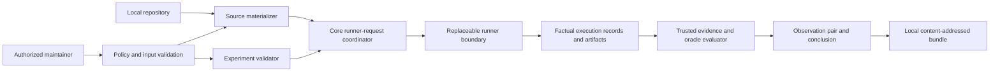

# Abaris Architecture

## Status

This document defines the planned v0 architecture. No components exist yet.
Requirements described here are not implemented guarantees.

## Architectural objective

Abaris performs one controlled paired experiment:

```text
local repository
+ immutable baseline revision
+ immutable candidate revision
+ one supplied reproducer
+ one vulnerability-presence oracle
+ one comparison policy
-> two isolated runs
-> two primary observations
-> one conservative derived conclusion
-> one content-addressed evidence bundle
```

The architecture must make it difficult to accidentally claim more than the
experiment demonstrates.

## v0 boundaries

v0 accepts only local repository paths and curated, already-public historical
vulnerability cases.

v0 does not perform discovery, exploit generation, root-cause verification,
variant analysis, affected-version inference, duplicate detection, automatic
patch generation, automatic disclosure, hosted execution, or broad regression
analysis.

The first target ecosystem remains an open decision.

## System model



## Planned components

### Trusted control plane

The control plane validates the experiment, checks policy, coordinates both
runs, collects evidence, assigns observations, and derives the conclusion.

For execution, the core derives one bounded runner request for exactly one
`baseline` or `candidate` side and one declared phase. It coordinates all
requests, validates returned execution records and mandatory-policy status,
evaluates the oracle, assigns observations, derives the conclusion, and
assembles or coordinates the authoritative evidence bundle.

It must not:

- execute repository-provided behavior directly on the host;
- accept workload text as an authoritative observation;
- expose host secrets, home-directory mounts, or a Docker socket;
- silently change policy between runs; or
- use AI to assign observations or conclusions.

### Source materializer

The materializer accepts a local repository path and resolves baseline and
candidate Git references to immutable commit identities.

It must:

- operate in an Abaris-controlled, non-interactive Git environment;
- ignore inherited system, global, user, and untrusted repository-local
  configuration where possible;
- disable hooks, clean/smudge/process filters, credential helpers, automatic
  LFS downloads, submodule initialization, and external protocols;
- avoid Git hooks and all repository code execution;
- avoid modifying the operator's working tree;
- reject submodules and external content by default;
- reject object alternates, promisor or partial-clone acquisition, replace
  refs, and other object-resolution behavior that can read undeclared external
  content;
- reject unsafe symlinks before execution;
- create isolated source snapshots;
- preserve exact commit, tree, snapshot, Git-version, and materialization-policy
  identities;
- emit a trusted materialization record containing requested controls, enforced
  controls, rejected features, violations, and final outcome; and
- reject unsafe paths and unresolved required identities.

A local path is an input-location restriction, not a trust guarantee.

The preferred strategy is direct extraction from Git tree objects into an
Abaris-owned directory, with explicit file-type and symlink validation. A
sanitized checkout may be evaluated only as a bounded fallback. Normal
`git clone && git checkout`, inherited Git configuration, LFS smudge, and
automatic submodule initialization are not acceptable v0 materialization.

### Experiment validator

The validator checks one reproducer, one oracle, and one comparison policy.
Inputs must be versioned, bounded, explicit, and content-identified.

It must reject:

- unknown or unsupported behavior;
- implicit shell execution;
- undeclared mounts, secrets, sockets, devices, or privileges;
- missing resource limits;
- missing setup-network or reproduction-network policy;
- mutable required input identity; and
- any comparison that cannot satisfy the equivalence contract.

### Runner boundary

The runner is an execution boundary, not a verdict authority.

The core sends the replaceable runner boundary one conceptual request for one
side and one declared execution phase. The runner applies the received
policies, attempts the phase, and returns factual execution status and captured
evidence references. The core coordinates multiple phases and both sides.
Phase names are private-draft and illustrative; they do not define a stable
taxonomy.

A future runner may use a qualifying execution backend beneath this boundary.
ADR-030 neither selects that backend nor permits backend-specific behavior to
define core observation or conclusion semantics.

A supported runner is part of the future trusted computing base for applying
controls and reporting execution facts. It is not trusted to decide normative
failure classification, observations, conclusions, or evidence-bundle
authority. Concrete trust analysis and conformance testing remain deferred
until a runner and backend are selected.

A conceptual runner request contains:

```text
run identity
baseline or candidate side
one illustrative private-draft phase
already-materialized source reference
command identity, working directory, and declared environment
resource limits and network contract
optional target configuration
artifact-capture and redaction constraints
mandatory controls to apply and report
```

The runner receives source already materialized under ADR-026. It must not
fetch remotes, initialize submodules, acquire LFS content, use object
alternates, honor replace refs, acquire partial-clone or promisor objects,
rematerialize source, or otherwise weaken the materialization policy.

The returned execution record contains factual audit data:

```text
side and execution-attempt identity
runner identity when available, or explicit unavailability
phase and command identity
effective execution parameters
applied controls and policy-enforcement status
start and end timestamps
process result, termination reason, timeout, and resource-limit status
network-policy and materialized-source-access status
captured evidence and artifact references
infrastructure errors and bounded warnings
```

Effective execution parameters are audit facts, not a stable public runner API.
Runner-reported failure labels and verdict-like labels are diagnostics only.
The core ignores them when assigning observations, selecting the bounded
normative `failure_reason`, or deriving conclusions.

An execution record is an input to the evidence bundle, not the evidence
bundle itself. The runner does not assemble an authoritative evidence bundle,
evaluate the oracle, assign `PRESENT`, `ABSENT`, or `INDETERMINATE`, select the
normative `failure_reason`, or derive a comparative conclusion.

If a mandatory control cannot be applied before execution, the runner must
refuse the attempt and report that execution did not start. If execution starts
without a mandatory control, the runner cannot report a mandatory-policy
status, or a post-start infrastructure failure occurs, the core treats the
execution as ineligible for an authoritative determinate observation and
applies ADR-028. Infrastructure failure cannot become `ABSENT`.

The normative flow is:

```text
contract
-> pre-execution eligibility checks
-> runner request
-> factual execution record
-> completion of ADR-028 eligibility gates by the core
-> oracle evaluation by the core
-> observation
-> conclusion matrix
-> evidence bundle
```

The normative private-draft runner-boundary fixture is
[adr-030-runner-boundary.json](fixtures/adr-030-runner-boundary.json). It
defines conceptual boundary examples, not a stable runner API, phase taxonomy,
backend contract, or public schema.

### Execution backend

Each revision runs in a separate disposable isolated environment. A qualifying
backend must provide:

- no host secrets;
- no home-directory mount;
- no Docker or equivalent host-control socket;
- no undeclared writable host path;
- no unnecessary device, privilege, or capability;
- explicit setup-network enforcement;
- no reproduction network for non-network cases;
- a closed per-run network for declared service-target cases;
- external reproduction egress denied;
- externally enforced CPU, memory, process, disk, output, and wall-clock
  limits; and
- guaranteed teardown.

Containers may be used inside a supported design, but containers alone are not
a sufficient hostile-code boundary.

### Closed reproduction network

For a service-target case, the backend creates one new per-run network
containing only:

- one reproducer participant; and
- one declared target participant.

The policy permits reproducer-initiated connections only to declared target
aliases and ports, plus response traffic for those connections. It denies:

- external egress;
- host and gateway access;
- cloud metadata and link-local metadata ranges;
- at minimum `169.254.0.0/16`, `169.254.169.254/32`,
  `fd00:ec2::254/128`, and `fd20:ce::254/128`;
- runtime-provided host aliases such as `host.docker.internal` and
  `gateway.docker.internal`;
- external DNS;
- target-initiated connections to the reproducer unless a future case
  explicitly requires and models them;
- undeclared peers and ingress;
- published host ports; and
- IPv6 unless explicitly modeled and equivalently restricted.

The backend must detect or record policy violations and fail closed if it cannot
apply the policy. Docker or another runtime may help implement this design, but
an internal runtime network alone is insufficient because host or gateway
communication may remain possible.

If mandatory network controls cannot be applied or verified before execution,
the run is refused. A control failure or violation discovered after execution
begins makes the affected observation `INDETERMINATE` with a bounded
`failure_reason`; it cannot yield `PRESENT` or `ABSENT`.

### Trusted evidence collector and oracle evaluator

The evaluator consumes collected evidence and assigns exactly one observation
per revision:

- `PRESENT`
- `ABSENT`
- `INDETERMINATE`

The workload cannot set this state directly. If the oracle is represented by
executable or workload-produced behavior, its outputs remain untrusted inputs
to trusted evaluation.

Each run result keeps three concepts separate:

- `observation`: exactly one of `PRESENT`, `ABSENT`, or `INDETERMINATE`;
- `failure_reason`: a bounded technical reason required only when the
  observation is `INDETERMINATE`; and
- `evidence`: the attributable inputs used by trusted evaluation.

`failure_reason` is reserved for `INDETERMINATE`. Determinate runs may record
warnings or non-decisive events separately, but those records cannot be
represented as the reason for an indeterminate observation.

The derived conclusion remains a separate paired-run result.

Invalid oracle contracts are rejected before execution and produce no
observations. Accepted contracts use exactly one atomic declarative predicate.
Arbitrary executable predicates, workload-authoritative observations, compound
or ordered predicates, scoring, AI-dependent evaluation, and
oracle-initiated network traffic are unsupported.

#### Observation eligibility gates

The evaluator applies ordered fail-closed gates before evaluating the atomic
predicate:

1. Mandatory materialization, isolation, network-policy, collection, and
   evaluator controls completed and remained verifiable.
2. The paired experiment satisfies the comparison-equivalence contract.
3. The run and its oracle use only supported conditions.
4. No resource limit invalidated evaluation.
5. No timeout invalidated evaluation.
6. Any declared target started successfully and remained eligible.
7. The reproducer completed in a state that permits oracle evaluation.
8. Every required evidence object is present.
9. No required evidence object is truncated.
10. Every required evidence object is valid for its declared type.
11. Required evidence is unambiguous.

If every gate passes, the predicate is evaluated. Predicate truth produces
`PRESENT`; predicate falsehood produces `ABSENT`.

Invalid contracts or unavailable mandatory controls detected before execution
refuse the experiment and produce no observations. If one or more gates fail
or become unverifiable after execution begins, the predicate is not evaluated.
The affected run is `INDETERMINATE`, receives exactly one primary bounded
`failure_reason`, and preserves all gate failures and details as separate
evidence. A cross-run comparison-equivalence failure discovered after execution
begins makes both affected observations `INDETERMINATE`.

#### Atomic oracle predicates

The first private-draft predicate set is:

| Predicate | Required evidence | Truth condition |
| --- | --- | --- |
| Exact process exit code | Complete trusted process outcome | Recorded exit code equals the declared integer |
| Exact process signal | Complete trusted process outcome | Recorded terminating signal equals the declared signal |
| Stdout or stderr regular-expression search | Complete bounded UTF-8 stream | Declared restricted expression matches the declared stream |
| Declared file existence | Complete trusted artifact inventory | Declared relative artifact path exists |
| Declared-file content regular-expression search | Complete bounded UTF-8 declared file | Declared restricted expression matches the file content |
| Closed-network HTTP response status | Complete trusted response record from declared reproducer-target traffic | Recorded status equals the declared integer |
| Closed-network HTTP response body regular-expression search | Complete bounded UTF-8 trusted response body from declared reproducer-target traffic | Declared restricted expression matches the response body |

An exit code, signal, absent declared file, differing HTTP status, or unmatched
bounded content is not automatically a failure when it is the predicate's
subject. For example, declared-file existence evaluates false when the trusted
artifact inventory is complete and the subject path is absent; it is
`EVIDENCE_MISSING` only when the inventory required to make that determination
is absent.

Regular-expression predicates use a restricted linear-time profile. They reject
unsupported syntax and require complete bounded UTF-8 evidence. The exact
engine and numeric bounds remain private-draft implementation decisions, but an
accepted contract and its preserved evaluation record must identify them.

HTTP predicates evaluate only already-collected evidence from traffic permitted
by the closed reproduction-network contract. The oracle does not initiate
network activity.

#### Failure reason taxonomy

The evaluator selects the first applicable primary failure reason by this fixed
precedence:

| Precedence | Failure reason | Meaning |
| --- | --- | --- |
| 1 | `INFRASTRUCTURE_FAILURE` | A mandatory materialization, isolation, network-policy, collector, or evaluator control failed or became unverifiable |
| 2 | `COMPARISON_EQUIVALENCE_FAILURE` | A required paired-run equivalence condition failed or became unverifiable |
| 3 | `UNSUPPORTED_CONDITION` | Evaluation encountered a required condition or evidence form outside the accepted private-draft contract |
| 4 | `RESOURCE_LIMIT_EXCEEDED` | An externally enforced resource limit event invalidated reliable evaluation |
| 5 | `TIMEOUT` | A declared step or total wall-clock timeout invalidated reliable evaluation |
| 6 | `TARGET_STARTUP_FAILURE` | A declared target did not reach or retain the required state for reliable evaluation |
| 7 | `REPRODUCER_FAILURE` | The reproducer failed in a way that prevented reliable predicate evaluation |
| 8 | `EVIDENCE_MISSING` | Evidence required to evaluate the predicate is absent |
| 9 | `EVIDENCE_TRUNCATED` | Evidence required to evaluate the predicate is incomplete because it was truncated |
| 10 | `EVIDENCE_INVALID` | Evidence required to evaluate the predicate is malformed or invalid for its declared type |
| 11 | `EVIDENCE_AMBIGUOUS` | Complete valid evidence supports no single deterministic predicate input |

The taxonomy does not replace evidence: the selected reason and every observed
gate failure, specific cause, violation, and lower-precedence event are
preserved separately.

#### Observation assignment invariants

- `PRESENT` is valid only after every eligibility gate passes and the atomic
  predicate evaluates true.
- `ABSENT` is valid only after every eligibility gate passes and the atomic
  predicate evaluates false.
- `INDETERMINATE` is never coerced into `ABSENT`.
- Invalid contracts produce no observation and no comparative conclusion.
- Unavailable mandatory controls detected before execution produce no
  observation and no comparative conclusion.
- Every `INDETERMINATE` observation has exactly one bounded primary
  `failure_reason`.
- Workload, target, reproducer, script, and AI output are never authoritative
  for an observation. They may contribute only untrusted evidence evaluated
  through the declared atomic predicate.
- A conclusion compares the two assigned observations. It does not reinterpret
  raw execution, evidence, diagnostics, or failure events independently.

### Conclusion derivation

The conclusion derivation is a deterministic pure mapping from the two
observations. It must not inspect narrative metadata or use AI.

### Local evidence store

The evidence store preserves a self-describing content-addressed bundle.
Publication and export require explicit human action.

Content addressing proves object identity and detects modification. It does not
prove that evidence is complete, correct, confidential, or safe to publish.

## Paired-experiment equivalence contract

The comparison is valid only if both runs use the same:

- reproducer identity;
- oracle identity and semantics;
- declared fixtures and inputs;
- control-plane version and observation rules;
- comparison policy;
- setup-network and reproduction-network policy;
- resource-limit policy;
- base environment contract; and
- permitted difference rules.

The source revision is intentionally different. Revision-owned dependency
manifests and setup outcomes may therefore differ, but those differences must
be recorded as evidence and may cause `INDETERMINATE` when they prevent a
meaningful comparison.

No difference may be silently normalized away.

## Execution phases

### 1. Validate

Validate authorization acknowledgement, local path, experiment schema, oracle,
limits, policy, and supported capabilities.

### 2. Materialize

Resolve immutable source identities and create separate snapshots without
executing repository code.

### 3. Setup

Prepare each isolated environment. Setup may execute untrusted project or
dependency behavior.

Setup network requires an explicit policy. Enabling it weakens reproducibility
and expands the attack surface; all relevant policy and outcomes must be
recorded. The exact supported policy modes remain unresolved.

### 4. Reproduce

Apply the same reproducer to each prepared revision. Non-network cases receive
no reproduction network. Service-target cases receive only the closed per-run
network defined above.

### 5. Collect

Collect bounded trusted observations and declared artifacts outside workload
authority. Record omissions, truncation, timeouts, violations, and failures.

### 6. Evaluate

Apply the same oracle semantics to each run and assign one three-state
observation.

### 7. Derive

Map the paired observations to one conclusion.

### 8. Preserve and teardown

Finalize the content-addressed bundle and destroy both isolated environments.

## Observation semantics

### `PRESENT`

Assign only when:

- the run and required controls completed in a supported state;
- required evidence is complete and valid; and
- trusted oracle evaluation demonstrates the defined presence condition.

### `ABSENT`

Assign only when:

- the run and required controls completed in a supported state;
- required evidence is complete and valid; and
- trusted oracle evaluation did not demonstrate the defined presence
  condition.

`ABSENT` is not proof that a vulnerability is fixed or absent generally.

### `INDETERMINATE`

Assign when reliable `PRESENT` or `ABSENT` evaluation is impossible, including:

- setup or reproduction failure that invalidates the oracle;
- timeout or resource-limit event that prevents reliable evaluation;
- missing, contradictory, invalid, or truncated required evidence;
- unsupported behavior or environment;
- policy or isolation failure;
- oracle ambiguity or evaluator failure; or
- comparison-equivalence failure.

Every `INDETERMINATE` observation must include a bounded `failure_reason`.
ADR-028 defines the first private-draft taxonomy and atomic oracle predicates.

## Conclusion matrix

This table is the single normative observation-to-conclusion mapping. Other
documents may summarize it, but implementations and table-driven fixtures must
be validated against this table.

| Baseline observation | Candidate observation | Derived conclusion |
| --- | --- | --- |
| `PRESENT` | `ABSENT` | `REPRODUCER_BLOCKED` |
| `PRESENT` | `PRESENT` | `REPRODUCER_STILL_SUCCEEDS` |
| `ABSENT` | `ABSENT` | `BASELINE_NOT_REPRODUCED` |
| `ABSENT` | `PRESENT` | `CANDIDATE_ONLY_PRESENT` |
| `PRESENT` | `INDETERMINATE` | `INCONCLUSIVE` |
| `ABSENT` | `INDETERMINATE` | `INCONCLUSIVE` |
| `INDETERMINATE` | `PRESENT` | `INCONCLUSIVE` |
| `INDETERMINATE` | `ABSENT` | `INCONCLUSIVE` |
| `INDETERMINATE` | `INDETERMINATE` | `INCONCLUSIVE` |

Normative invariants:

- every valid observation pair maps to exactly one conclusion;
- `CANDIDATE_ONLY_PRESENT` is never a success conclusion; and
- `INCONCLUSIVE` occurs if and only if at least one observation is
  `INDETERMINATE`.

`CANDIDATE_ONLY_PRESENT` records a valid comparative asymmetry and blocks patch
validation success. It does not prove a regression, newly introduced
vulnerability, severity, exploitability, or root cause.

`REPRODUCER_BLOCKED` is retained as a product term, but every output must state
that it describes only the supplied reproducer and oracle under recorded
conditions.

## Evidence bundle

A finalized authoritative evidence bundle is a local audit artifact for one
completed paired result. It exists only when its minimum audit chain permits a
reviewer or independent verifier to verify the declared contract, applied
policies, baseline and candidate observations, and deterministic conclusion
derivation.

The minimum audit chain contains:

```text
bundle identity, private-draft evidence-bundle and experiment-contract identities
tool identity and timestamps
requested source references and resolved commit, tree, and snapshot identities
source materialization controls, records, violations, and outcomes
reproducer, oracle, comparison, network, and limit policy identities
environment and platform identity when available, or explicit availability status
baseline and candidate execution, collection, oracle-evaluation, and observation records
one primary failure reason for each indeterminate observation
captured artifact references, provenance, digests, and availability status
paired observations and the conclusion derived from the normative matrix
manifest digest, redaction record, warnings, limitations, and non-goals
```

The bundle preserves the observations assigned under ADR-028 and the conclusion
derived from their pair under ADR-004. It does not independently reinterpret
raw execution records, workload output, advisory metadata, or captured logs.
Raw evidence cannot override an assigned observation or conclusion.

### Completeness boundary

If the minimum audit chain is incomplete before observation assignment, Abaris
may preserve a distinct local attempt record, but it must not produce
observations, an authoritative evidence bundle, or a comparative conclusion.
ADR-029 defines the existence and conceptual boundary of that non-conclusive
attempt record, not its serialization or stable schema.

After execution begins, missing, invalid, ambiguous, or truncated
predicate-relevant evidence makes the affected observation `INDETERMINATE`
under ADR-028. A finalized authoritative bundle may preserve that result only
when the remaining minimum audit chain permits audit of the contract, policies,
both observations, and conclusion derivation.

If required bundle-level audit evidence is unavailable, the partial material
is not an authoritative evidence bundle and carries no authoritative
comparative conclusion.

### Integrity and redaction

Every captured artifact must have provenance and a content digest. The manifest
references captured-artifact digests and has its own digest. Verification can
therefore detect changes to retained content, but cannot authenticate the
producer, provide non-repudiation, prove completeness or correctness, protect
confidentiality, or make evidence safe to publish.

Missing, transformed, redacted, omitted, or truncated content must be explicit.
The redaction record identifies categories preserved, transformed, redacted,
and omitted. Redaction must not silently alter result semantics. If redaction
removes, changes, or makes unavailable evidence relevant to the atomic
predicate, the affected observation cannot remain `PRESENT` or `ABSENT`; it
becomes `INDETERMINATE` or is not produced, according to the ADR-028 execution
stage.

Cryptographic signing, key management, producer authentication,
non-repudiation, confidentiality controls, and independent verification
tooling remain unresolved. ADR-029 defines preserved evidence, not human-report
rendering or a public compatibility contract.

## Unsupported claim controls

Human- and machine-readable output must not state or imply:

- the vulnerability is universally fixed;
- the candidate is secure;
- root cause is corrected;
- variants are addressed;
- affected versions are known;
- broad regressions were excluded; or
- the patch is generally complete.

## Major unresolved decisions

- First target ecosystem and supported project subset.
- Execution backend and supported host platforms.
- Setup-network policy modes and evidence requirements.
- Dependency acquisition and immutable identity.
- Rerun and nondeterminism policy.
- Runner and backend implementation, conformance testing, and final interface
  serialization.
- Evidence serialization, retention, deletion, encryption, signing,
  authentication, independent verification tooling, and safe export review.
- Exact support policy for submodules and external source mechanisms.

## Schema stabilization gate

Private draft experiment, oracle, and evidence contracts may evolve while
Abaris exercises 3–5 representative historical cases. No public stable schema
or compatibility promise is allowed before that review.

Every private draft artifact must self-identify its `private-draft` stability
and absence of compatibility guarantees.

The cases must collectively exercise a networked target, a non-network input, a
process failure signal, dependency or materialization sensitivity, a
fixed-candidate result, an inconclusive result, and candidate-only presence.

Schema areas discovered through those cases include oracle grammar, network
declarations, evidence taxonomy, failure reasons, and any need for LFS or
submodule representation. Features outside v0 must not be added merely to make
the draft schema broad.

## Primary technical references

- [Docker networking overview](https://docs.docker.com/engine/network/)
- [Docker internal network behavior](https://docs.docker.com/reference/cli/docker/network/create/#network-internal-mode---internal)
- [Git hooks](https://git-scm.com/docs/githooks)
- [Git configuration](https://git-scm.com/docs/git-config)
- [Git submodules](https://git-scm.com/docs/git-submodule)
- [Git repository layout and alternates](https://git-scm.com/docs/gitrepository-layout)
- [Git partial clone and promisor objects](https://git-scm.com/docs/partial-clone)
- [Git replace refs](https://git-scm.com/docs/git-replace)
- [AWS EC2 instance metadata endpoints](https://docs.aws.amazon.com/AWSEC2/latest/UserGuide/instancedata-data-retrieval.html)
- [Google Compute Engine metadata endpoints](https://cloud.google.com/compute/docs/metadata/overview)
